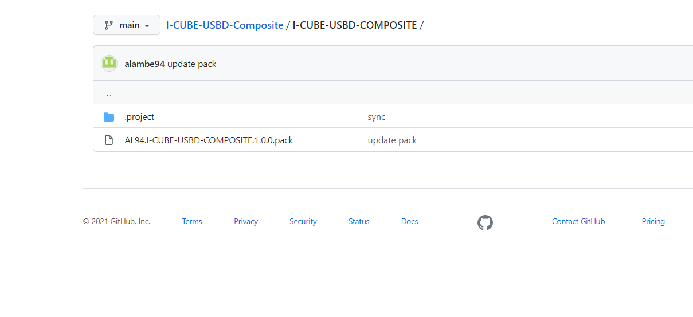
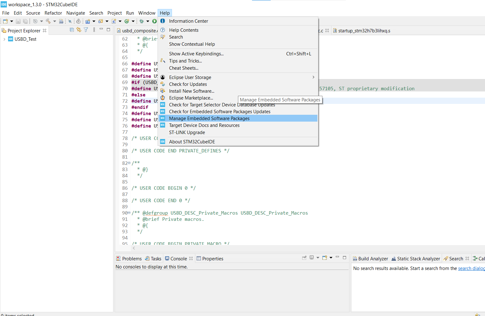
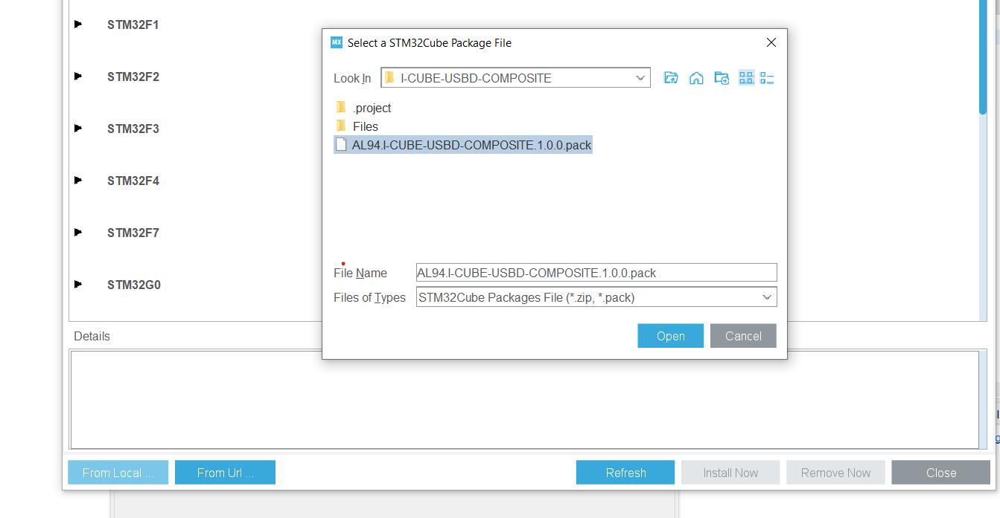
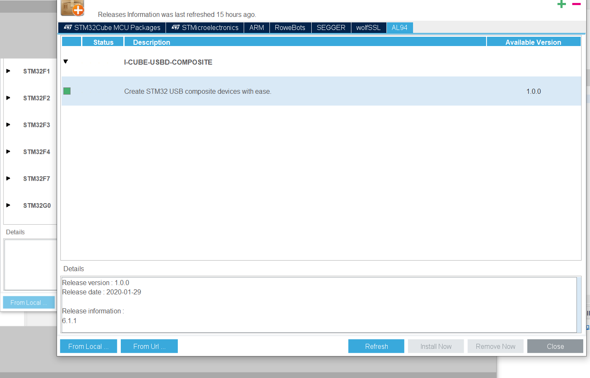
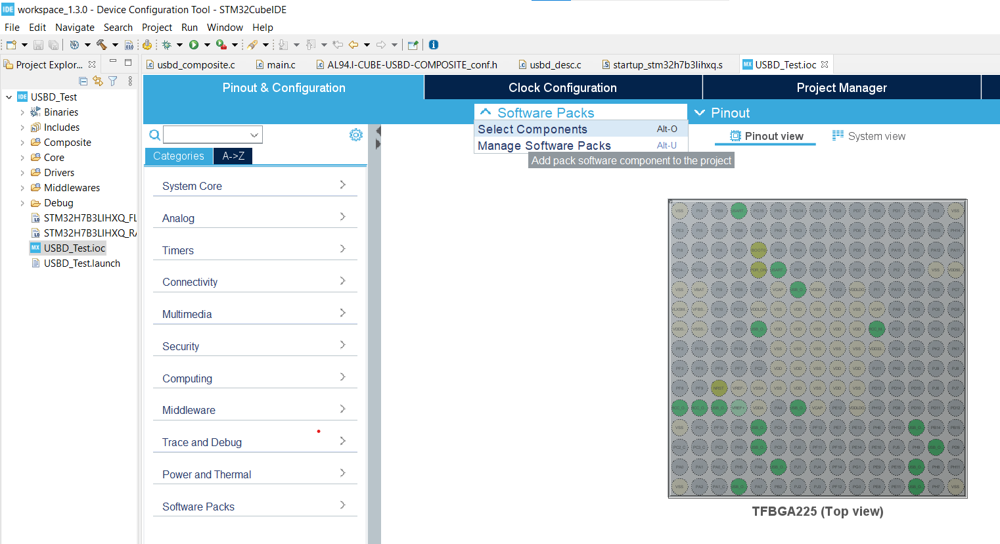
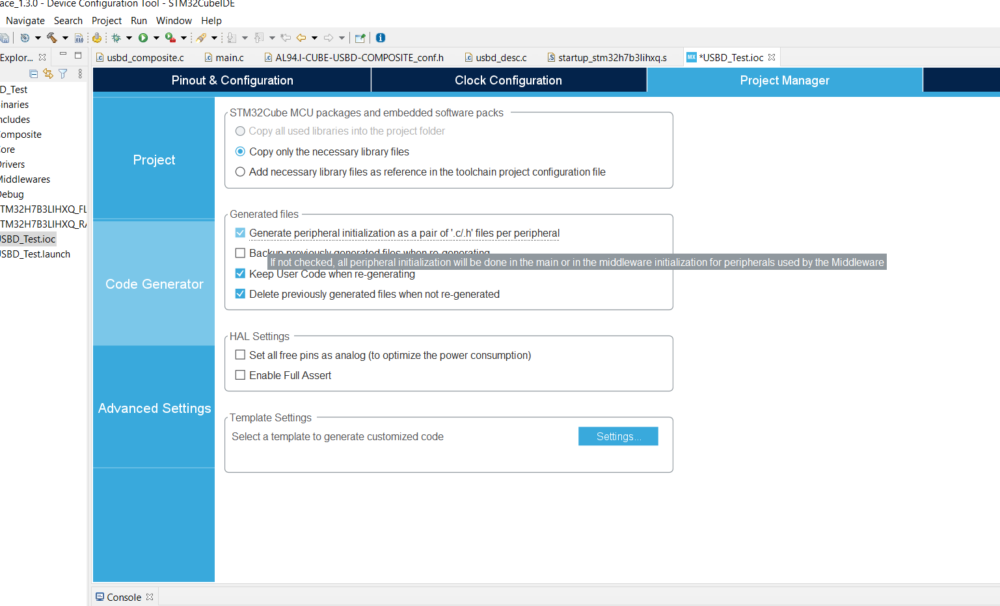
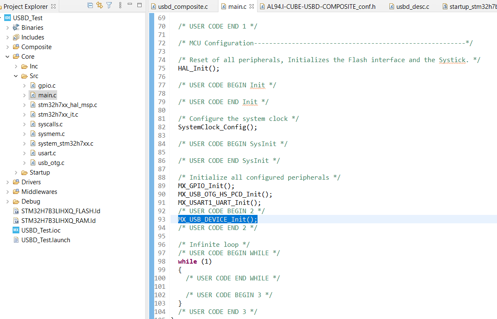
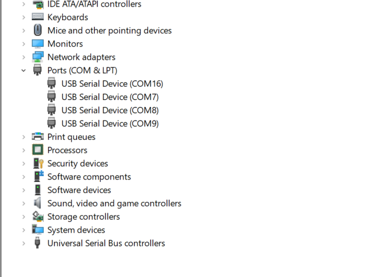
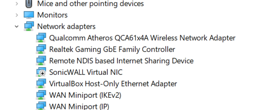
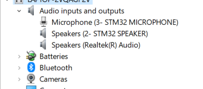

# I-CUBE-USBD-Composite
A wrapper class around ST USB stack to create STM32 USB Composite devices with ease.
## Modifications
* CDC supports multiple instance
* Removed ST use of malloc
* UAC Microphone & Speaker separated
* HID Keyboard & Mouse separated

## TODO
* Add CubeMX Templates
* Fix UAC combination with other classes

## How to use
### 1. Download AL94.I-CUBE-USBD-COMPOSITE.1.0.0.pack from repo.

### 2. Add AL94.I-CUBE-USBD-COMPOSITE.1.0.0.pack to CubeMX.

### 3. Inlude in project
Enable USB peripheral & NVIC

Add middleware to project

Add components to project, Selection of Core & COMPOSITE is must

Enable the classes you want

Dont forget!!!

### 4. Generate Code
Call MX_USB_DEVICE_Init(); manually

## Enumerated
### 1. USB CDC ACM.

### 2. CDC & HID.

### 3. RNDIS.

### 4. UAC Microphone & Speaker.

### 5. UVC Camera & Mass Storage.

# Troubleshooting
1. Cross check number of endpoints in MCU & consumed by application.
2. Adjust Endpont Size & PMA buffers in "Target/usbd_conf.c" accordingly.
3. For some classes "SOF" must be enabled!!!
4. Make sure MCU clock is configured properly & USB Interrupt is enabled.
5. For L5 HAL_PWREx_EnableVddUSB() needs to be called before enabling USB operation.
